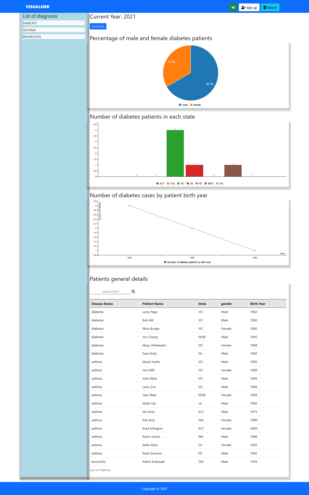
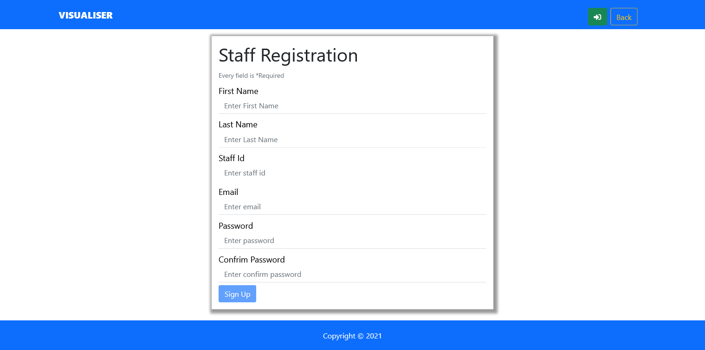
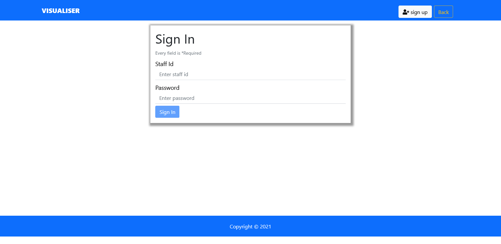
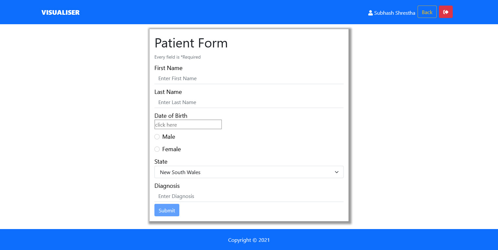

  # Title
  ## Visualiser
  
  
  
  ## Table of contents 
  - [Description](#description)
  - [Installation](#installation)
  - [Usage Information](#usage-information)
  - [License](#license)
  - [Contribution Guidelines](#contribution-guidelines)
  - [Test Procedure](#test-procedure)
  - [Screenshot](#screenshot)
  - [deployed](#deployed)
  - [Questions](#questions)
  
  ## Description
     This application built by using nodejs, express, jwt, and mongoose. This application structure follows 
     the Model-View-Controller pattern where controller as routes, and mongoose library as 
     database connection and schema definition, jwt as authentication. This app provides visualisation of input data.

  ## Installation
     first need to clone from given github link and need to perform 'npm i' on terminal within the project location. 
     Second, type on terminal 'npm start' to run the application then create aacout and insert data 
     Fourth, observe the visualisation in table, bar, pie and line garphs.  

  ## Usage Information
     It is useful to observe the inserted data into different forms, user can take as reference and can take decision for future
     plan.

  ## License
     MIT license
  
  ## Contribution Guidelines
     N/A

  ## Test Procedure
     N/A
  
  ## Screenshots
  ### Dashboard
  

  ### Registration
  

  ### Sign in
  

  ### Patient Form
  

  ## deployed
  
  
  ## Questions
    if you have questions then please feel free to contact on these addresses,
  
  Github: [SthaSub](https://github.com/SthaSub)
  
  Email: [subhashshrestha3@gmail.com](subhashshrestha3@gmail.com)
    